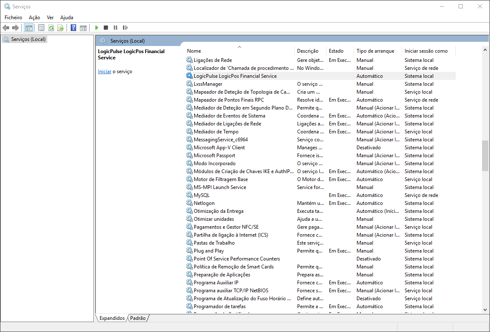
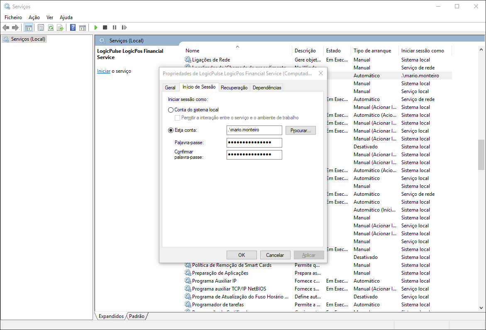
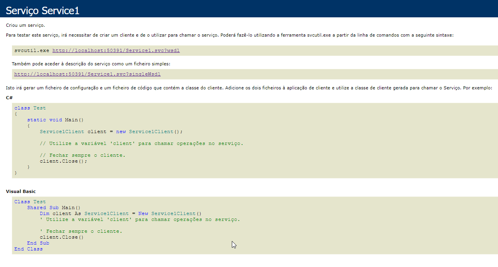

# Logicpulse LogicPos : Install Binary/Pre Compiled Version Quick Setup Notes

---
## Windows RunTime Requirements

1) Install [Microsoft .NET Framework 4.6.1](https://www.microsoft.com/pt-pt/download/details.aspx?id=49981)

2) [GTK 2.12.22+](https://www.gtk.org/download/index.php)

!!! note "Note"
    installer in folder `others\windowsruntime\gtk-sharp-2.12.22.msi`

3) Install GTK Nodoka Theme Engine

copy `others\windowsruntime\libnodoka.dll` to
   `c:\Program Files\GtkSharp\2.12\lib\gtk-2.0\2.10.0\engines\` (32bit), or 
   `c:\Program Files (x86)\GtkSharp\2.12\lib\gtk-2.0\2.10.0\engines\` (64bit)

4) Required to Restart Windows (GTK Runtime Requirement)

5) Now we can install/Run LogicPos

---
## Database Requirements

To work with LogicPos we need a data store, currently we can use [MySql Server](https://dev.mysql.com/downloads/mysql/), [Miscrosoft SqlServer](https://www.microsoft.com/pt-pt/sql-server/sql-server-downloads) or [Sqlite](https://sqlite.org/), bu technically we can use any data source comopatible with [eXpressPersistent Objects™ (XPO)](https://www.devexpress.com/products/net/orm/) 

!!! note "Note"
        - To work with [MySql Server](https://dev.mysql.com/downloads/mysql/) or [Miscrosoft SqlServer](https://www.microsoft.com/pt-pt/sql-server/sql-server-downloads) we need first to install server
        - To Work With [Sqlite](https://sqlite.org/) we dont need to install anything

!!! tip "Tip"
        - Recommended data sources: Mysql and SqlServer

--- 
## Configure LogicPos Database Connection

After we choose a data store we need to configure it in application config 

Open and edit config `logicpos\bin\Debug\logicpos.exe.config` 

**Configure Database**

1. **Option #1 : Mysql**

To work with **MySql** we need to edit `xpoConnectionString` to connect to local or remote **MySql Server Instance**

local

```xml
<add key="databaseType" value="MySql" />
<add key="xpoConnectionString" value="XpoProvider=MySql;server=localhost;database={0};user id=root;password=PASSWORD;persist security info=true;CharSet=utf8;" />
```

!!! note "Note"
    For remote server change `localhost` with remote ip, for ex `192.168.1.1`
    Dont forget to change `user id`, `password` according your needs.

2. **Option #2 : SqlServer**

To work with **SqlServer** we need to edit `xpoConnectionString` to point to our **SqlServer Server Instance**

local

```xml
<add key="databaseType" value="MSSqlServer" />
<add key="xpoConnectionString" value="XpoProvider=MSSqlServer;Data Source=SERVER\sql2008;Initial Catalog={0};User ID=sa;Password=PASSWORD;Persist Security Info=true;" />
```

!!! note "Note"
    Dont forget to change `user id`, `password` according your needs.

3. **Option #3 : SqlServer Express**

To work with **SqlServer Express** we need to edit `xpoConnectionString` to point to our **SqlServer Express Instance**, the connection string is a little diferent

```xml
<add key="databaseType" value="MSSqlServer" />
<add key="xpoConnectionString" value="XpoProvider=MSSqlServer;Data Source=.\SQLEXPRESS;Initial Catalog={0};User ID=mario.monteiro;Password=logicpulse#2014;Persist Security Info=true;Integrated Security=SSPI;Pooling=false;" />
```

4. Option #4 : Sqlite

```xml
<add key="databaseType" value="SQLite" />
<add key="xpoConnectionString" value="XpoProvider=MonoLite;uri=file:{0}.db" />
```

---
##  Run LogicPos

After **Configure LogicPos Database Connection** we can run LogicPos from `logicpos\bin\Debug\logicpos.exe` 

!!! tip"Tip"
    If we have problems running LogicPos we can look or tail the log locate at `logicpos\bin\Debug\logicpos.log`

---
## Install AT WebService from Binaries/Pre compiled

After succefully run LogicPos, we can setup AT WebServices to test with AT SandBox (Test Mode)

!!! note "Note"
    - We need a full path to `logicpos.financial.service.exe` to install windows service, here we use `logicpos.framework\logicpos.financial.service\bin\Debug\logicpos.financial.service.exe`

    - Change path according your needs, edit `logicpos.financial.service\Utils\service_install.bat` and check path to `logicpos.financial.service.exe`

    - Default in `service_install.bat` is: 
    
    ```
    SC create logicpulselogicposfinancialservice displayname= "LogicPulse LogicPos Financial Service" binpath= "\"c:\SVN\logicpos\trunk\src\logicpos_pos\logicpos.framework\logicpos.financial.service\bin\Debug\logicpos.financial.service.exe\"" start= auto
    ```

**Web Service Config Parameters**

`logicpos.framework\logicpos.financial.service\App.config`

```xml
<!--Global|Shared for DC|WB-->
<add key="servicesATRequestTimeout" value="5000" /> <!--Default:5000|Disabled:-1-->
<add key="servicesATTestModeFilePublicKey" value="ChavePublicaAT.cer" />
<add key="servicesATTestModeFileCertificate" value="TesteWebservice.pfx" />
<add key="servicesATProdModeFilePublicKey" value="000000000_0000.cer" />
<add key="servicesATProdModeFileCertificate" value="000000000.pfx" />
<!--DC:Documents-->
<add key="servicesATDCTestMode" value="true" />
<!--WB:WayBill Documents-->
<add key="servicesATWBTestMode" value="true" />
<add key="servicesATWBAgriculturalMode" value="true" />
```

!!! note "Note"
    `ATProd` configs corresponds own company certificates, here are ommited with `000000000`

Here we change values to false, to start productiohn mode, require to put your own certificates in directory 

**Windows Install Service**

1) Open a command line with adminstrator privileges and type above commands

```shell
cd logicpos.framework\logicpos.financial.service\Utils
service_install.bat

[SC] CreateService SUCCESS
```

If service is installed succefully, we receive a `[SC] CreateService SUCCESS` return message



2) We must assign a user to run the service, else we have error permissions with Certificates, press right mouse in service to pull context menu, and choose properties, next assign a user to service



3) Test and Run Service, press right mouse in service to pull context menu, and choose start

4) Test Service Url [http://localhost:50391/Service1.svc](http://localhost:50391/Service1.svc)



**Unistall, Start and Stop Bats**

To Unistall, start or stop we can use above bats

```
logicpos.framework\logicpos.financial.service\Utils\service_start.bat
logicpos.framework\logicpos.financial.service\Utils\service_stop.bat
logicpos.framework\logicpos.financial.service\Utils\service_uninstall.bat
```

**Location of Certificates**

**AT WebService** requires certificates to work, currently the LogicPos distro has **TesteWebService** certificates pre installed in directory `logicpos.framework\logicpos.financial.service\bin\Debug\Resources\Certificates\`

```
logicpos.framework\logicpos.financial.service\bin\Debug\Resources\Certificates\ChavePublicaAT.cer
logicpos.framework\logicpos.financial.service\bin\Debug\Resources\Certificates\TesteWebService.pfx
```

**Test AT WebService**

To test AT WebService, and after start windows service, we can launch LogicPos and emmit some **Financial** and **WayBill Documents**, they use a diferent endpoint in AT WebServices, we need to test both

Again we can view/tail the log file, to expose whats appening with windows service, the log file is located in `logicpos.framework\logicpos.financial.service\bin\Debug\logicpos.financial.service.log`

we can use a tool like [baretail](https://www.baremetalsoft.com/baretail/) to tail the log

**Start Service Log and Emmit Some Financial Invoices Documents**


```
Send Document DocumentNumber: [FS FS002012018S01/29]/WayBillMode: [False]
Send Document ReturnCode: [0]
Send Document ReturnMessage: [Documento registado com sucesso.]
Send Document DocumentNumber: [FS FS002012018S01/30]/WayBillMode: [False]
Send Document ReturnCode: [0]
Send Document ReturnMessage: [Documento registado com sucesso.]
Send Document DocumentNumber: [GT GT002012018S01/5]/WayBillMode: [True]
Send Document ReturnCode: [0]
Send Document ReturnMessage: [OK]
```

We can see that we have communication with TestMode WebService in above log.
